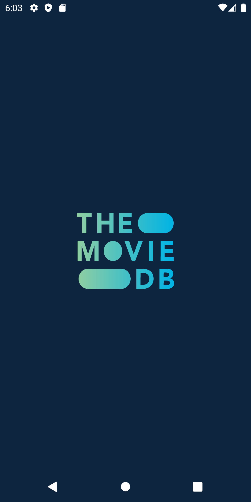
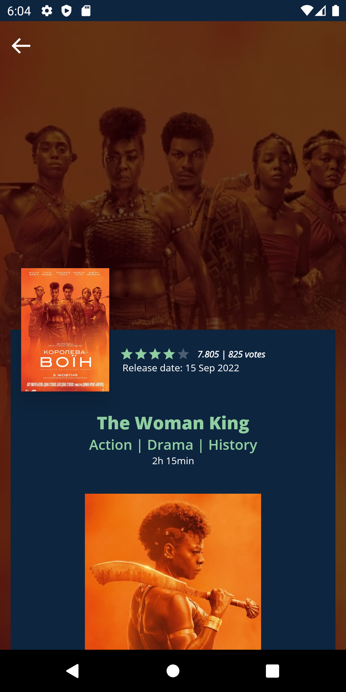
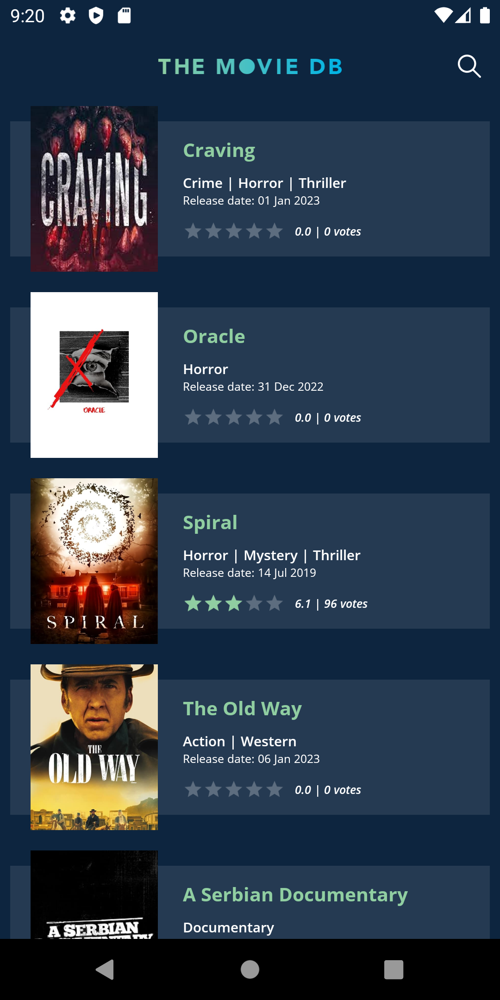
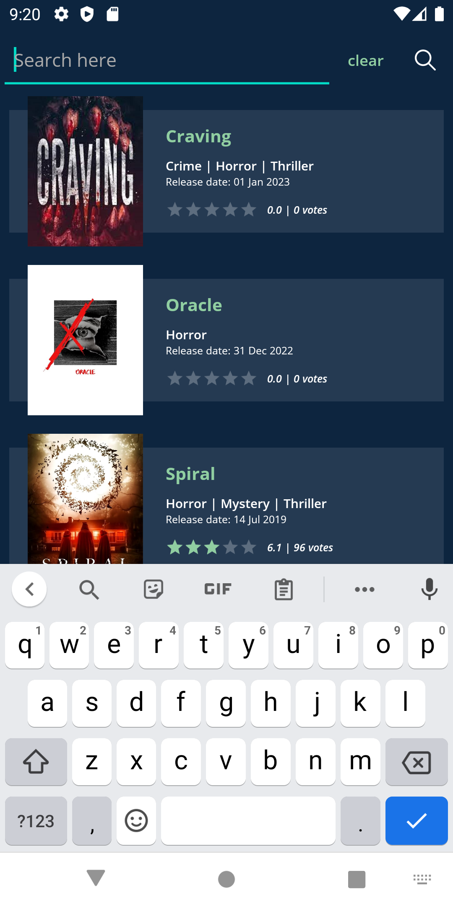
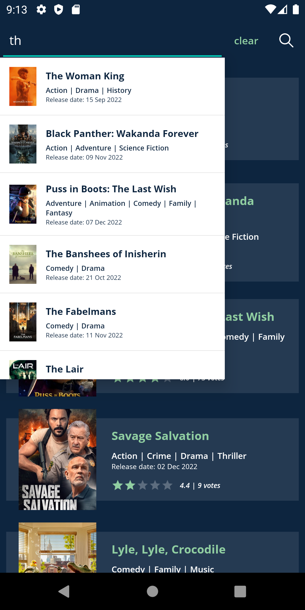
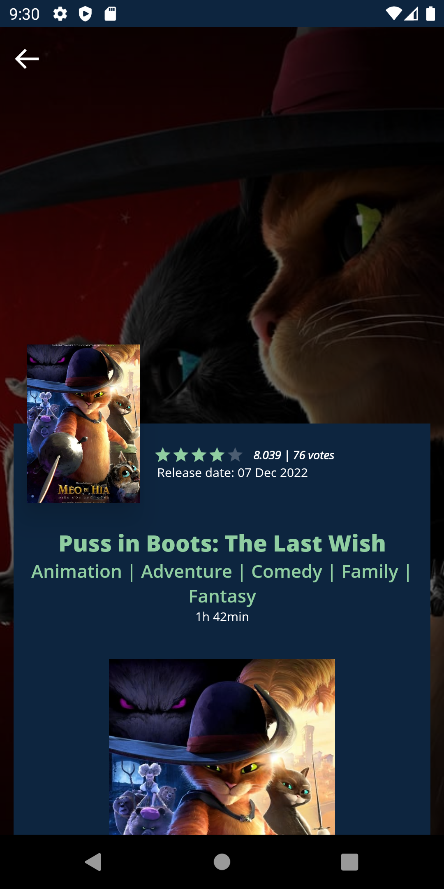
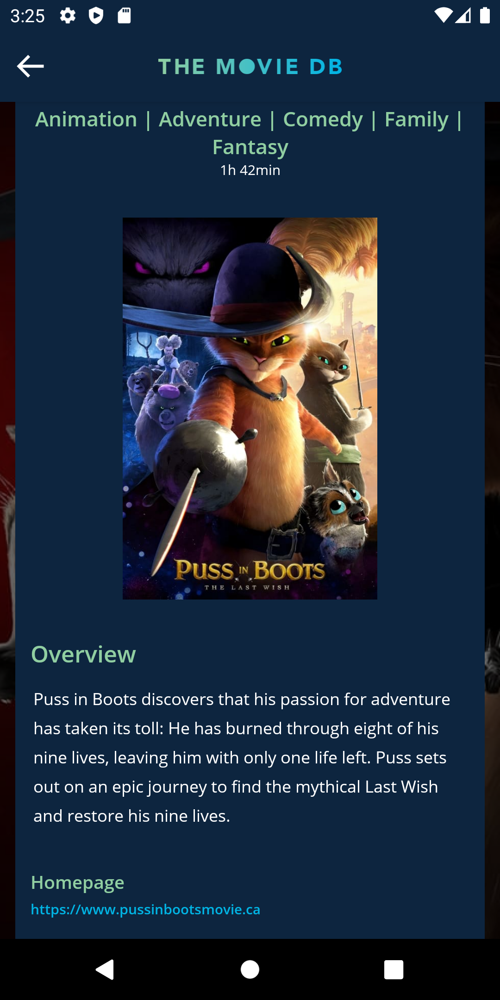

# TheMovieDB

  

A simple project using [TheMovieDb's](https://www.themoviedb.org/) API.
Features include:
- Upcoming movies with infinite scrolling
- Simple page for the details of the movie
- Search feature with auto complete function

## Screens
### Splash:

  

### Home:

  
  

### Search:

  
  

### Details:

  
  
  

### Info:
The Movie Database (TMDB) is a community built movie and TV database. Every piece of data has been added by our amazing community
dating back to 2008. TMDB's strong international focus and breadth of data is largely unmatched and something we're
incredibly proud of. Put simply, we live and breathe community and that's precisely what makes us different.

### Resource:
[TheMovieDb API Documentation](https://developers.themoviedb.org/3/getting-started/introduction)
